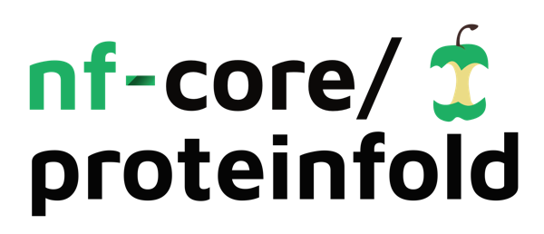

<h1>
  <picture>
    <source media="(prefers-color-scheme: dark)" srcset="docs/images/nf-core-proteinfold_logo_dark.png">
    
  </picture>
</h1>

[](https://github.com/nf-core/proteinfold/actions/workflows/nf-test.yml)
[](https://github.com/nf-core/proteinfold/actions/workflows/linting.yml)[](https://nf-co.re/proteinfold/results)[](https://doi.org/10.5281/zenodo.13135393)

[](https://www.nextflow.io/)
[](https://github.com/nf-core/tools/releases/tag/3.3.2)
[](https://docs.conda.io/en/latest/)
[](https://www.docker.com/)
[](https://sylabs.io/docs/)
[](https://cloud.seqera.io/launch?pipeline=https://github.com/nf-core/proteinfold)

[](https://nfcore.slack.com/channels/proteinfold)[](https://bsky.app/profile/nf-co.re)[](https://mstdn.science/@nf_core)[](https://www.youtube.com/c/nf-core)

## Introduction

**nf-core/proteinfold** is a bioinformatics best-practice analysis pipeline for Protein 3D structure prediction.

The pipeline is built using [Nextflow](https://www.nextflow.io), a workflow tool to run tasks across multiple compute infrastructures in a very portable manner. It uses Docker/Singularity containers making installation trivial and results highly reproducible. The [Nextflow DSL2](https://www.nextflow.io/docs/latest/dsl2.html) implementation of this pipeline uses one container per process which makes it much easier to maintain and update software dependencies. Where possible, these processes have been submitted to and installed from [nf-core/modules](https://github.com/nf-core/modules) in order to make them available to all nf-core pipelines, and to everyone within the Nextflow community!

On release, automated continuous integration tests run the pipeline on a full-sized dataset on the AWS cloud infrastructure. This ensures that the pipeline runs on AWS, has sensible resource allocation defaults set to run on real-world datasets, and permits the persistent storage of results to benchmark between pipeline releases and other analysis sources. The results obtained from the full-sized test can be viewed on the [nf-core website](https://nf-co.re/proteinfold/results).

## Pipeline summary


| Mode                                                                              | Protein | MSA server | Split MSA | RNA | Small-molecule | PTM  | Constraints | pLM |
| :-------------------------------------------------------------------------------- | :----: | :---------: | :------: | :--: | :------------: | :--: | :--------: | :--: |
| [AlphaFold2](https://github.com/deepmind/alphafold)                               |   ✅   |     ❌     |    ✅    | ❌  |       ❌       |  ❌ |     ❌     |  ❌ |
| [ESMFold](https://github.com/facebookresearch/esm)                                |   ✅   |     ❌     |    ❌    | ❌  |       ❌       |  ❌ |     ❌     |  ✅ |
| [ColabFold](https://github.com/sokrypton/ColabFold)                               |   ✅   |     ✅     |    ✅    | ❌  |       ❌       |  ❌ |     ❌     |  ❌ |
| [RoseTTAFold2NA](https://github.com/uw-ipd/RoseTTAFold2NA)                        |   ✅   |     ❌     |    ❌    | ✅  |       ❌       |  ❌ |     ❌     |  ❌ |
| [RoseTTAFold-All-Atom](https://github.com/baker-laboratory/RoseTTAFold-All-Atom/) |   ✅   |     ❌     |    ❌    | ✅  |       ✅       |  ✅ |     ❌     |  ❌ |
| [AlphaFold3](https://github.com/deepmind/alphafold)                               |   ✅   |     ❌     |    ❌    | ✅  |       ✅       |  ✅ |     ❌     |  ❌ |
| [Boltz](https://github.com/jwohlwend/boltz/)                                      |   ✅   |     ✅     |    ✅    | ✅  |       ✅       |  ✅ |     ✅     |  ❌ |
| [HelixFold3](https://github.com/PaddlePaddle/PaddleHelix/tree/dev/apps/protein_folding/helixfold3) | ✅ | ❌ | ❌  | ✅  |       ✅       |  ✅ |     ❌     |  ❌ |

**nf-core/proteinfold** supports multiple tools for general molecular structure prediction. Each of the methods have overlapping functionality which can be utilized within the pipeline. All tools support predicting protein structure from an input amino acid sequence. The pipeline is composed of the following steps:

1. Split input fasta file (Optional): The pipeline can split large batches of monomeric sequences (eg an entire genome) from a multi-entry fasta input using the `--split_fasta` flag.

2. Prepare databases for chosen methods: The pipeline downloads any required reference data.

3. Structure prediction:

    i. Combined: MSA Search + Model Inference: Structures are predicted from MSAs generated using built-in homolog search pipelines.

    ii. Split: AlphaFold2 MSA Search + Model Inference: The AlphaFold2 MSA generation pipeline is executed independently and then provided as input for AlphaFold2 structure prediction.

    iii. Split: ColabFold MSA Search + Model Inference: The ColabFold MSA generation pipeline is used to produce input MSAs which can be used by ColabFold and Boltz.

    iv. pLM: Protein Language Model: The ESMFold model is used to predict structures without generating an MSA.

4. Generate Report: The pipeline produces an interactive HTML report to visualize structure prediction outputs. 

5. Comparison Report: The structures predicted by parallel modes are combined in an interactive HTML report.

6. MultiQC: Overall QC statistics are summarized.

## Usage

> [!NOTE]
> If you are new to Nextflow and nf-core, please refer to [this page](https://nf-co.re/docs/usage/installation) on how to set-up Nextflow. Make sure to [test your setup](https://nf-co.re/docs/usage/introduction#how-to-run-a-pipeline) with `-profile test` before running the workflow on actual data.

First, prepare a samplesheet with your input data that looks as follows:

```csv title="samplesheet.csv"
id,fasta
T1024,T1024.fasta
T1026,T1026.fasta
```

Now, you can run the pipeline using:

```bash
nextflow run nf-core/proteinfold \
   -profile <docker/singularity/.../institute> \
   --input samplesheet.csv \
   --outdir <OUTDIR> \
   --mode <alphafold2/esmfold/colabfold/rosettafold2na/rosettafold-all-atom/alphafold3/boltz/helixfold3>
```

The pipeline takes care of downloading the databases and parameters required by each of the modes. In case you have already downloaded the required files, you can skip this step by providing the path to the databases using the `--db` parameter. 

```bash
nextflow run nf-core/proteinfold \
   -profile <docker/singularity/.../institute> \
   --input samplesheet.csv \
   --outdir <OUTDIR> \
   --mode <MODE> \
   --db <DBDIR>
```
> [!WARNING]
> The reference data for most methods is extremely large and may exceed individual user disk allocations on shared HPC systems.

In order to run multiple methods simultaneously where reference data is stored at different locations, the `--db` flag can be overwritten for each specific mode (e.g. `--alphafold2_db`, `--colabfold_db`, `--esmfold_db` and `--rosettafold_all_atom_db`). Please refer to the [usage documentation](https://nf-co.re/proteinfold/usage) to check the directory structure you must provide for each database.

> [!WARNING]
> Please provide pipeline parameters via the CLI or Nextflow `-params-file` option. Custom config files including those provided by the `-c` Nextflow option can be used to provide any configuration _**except for parameters**_; see [docs](https://nf-co.re/docs/usage/getting_started/configuration#custom-configuration-files).

For more details and further functionality, please refer to the [usage documentation](https://nf-co.re/proteinfold/usage) and the [parameter documentation](https://nf-co.re/proteinfold/parameters).

## Pipeline output

To see the results of an example test run with a full size dataset refer to the [results](https://nf-co.re/proteinfold/results) tab on the nf-core website pipeline page.
For more details about the output files and reports, please refer to the
[output documentation](https://nf-co.re/proteinfold/output).

## Credits

nf-core/proteinfold was originally written by Athanasios Baltzis ([@athbaltzis](https://github.com/athbaltzis)), Jose Espinosa-Carrasco ([@JoseEspinosa](https://github.com/JoseEspinosa)), Luisa Santus ([@luisas](https://github.com/luisas)) and Leila Mansouri ([@l-mansouri](https://github.com/l-mansouri)) from [The Comparative Bioinformatics Group](https://www.crg.eu/en/cedric_notredame) at [The Centre for Genomic Regulation, Spain](https://www.crg.eu/) under the umbrella of the [BovReg project](https://www.bovreg.eu/) and Harshil Patel ([@drpatelh](https://github.com/drpatelh)) from [Seqera Labs, Spain](https://seqera.io/).

Many thanks to others who have helped out and contributed along the way too, including (but not limited to): Norman Goodacre and Waleed Osman from Interline Therapeutics ([@interlinetx](https://github.com/interlinetx)), Martin Steinegger ([@martin-steinegger](https://github.com/martin-steinegger)) and Raoul J.P. Bonnal ([@rjpbonnal](https://github.com/rjpbonnal))

We would also like to thanks to the AWS Open Data Sponsorship Program for generously providing the resources necessary to host the data utilized in the testing, development, and deployment of nf-core proteinfold.

## Contributions and Support

If you would like to contribute to this pipeline, please see the [contributing guidelines](.github/CONTRIBUTING.md).

For further information or help, don't hesitate to get in touch on the [Slack `#proteinfold` channel](https://nfcore.slack.com/channels/proteinfold) (you can join with [this invite](https://nf-co.re/join/slack)).

## Citations

If you use nf-core/proteinfold for your analysis, please cite it using the following doi: [10.5281/zenodo.7437038](https://doi.org/10.5281/zenodo.7437038)

An extensive list of references for the tools used by the pipeline can be found in the [`CITATIONS.md`](CITATIONS.md) file.

You can cite the `nf-core` publication as follows:

> **The nf-core framework for community-curated bioinformatics pipelines.**
>
> Philip Ewels, Alexander Peltzer, Sven Fillinger, Harshil Patel, Johannes Alneberg, Andreas Wilm, Maxime Ulysse Garcia, Paolo Di Tommaso & Sven Nahnsen.
>
> _Nat Biotechnol._ 2020 Feb 13. doi: [10.1038/s41587-020-0439-x](https://dx.doi.org/10.1038/s41587-020-0439-x).
